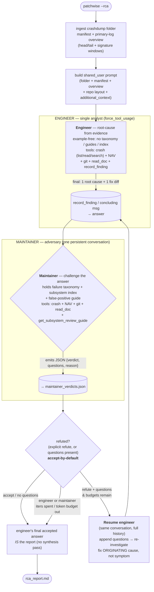

# PatchWise

<!-- [](LICENSE) -->
[](https://www.python.org/downloads/)
<!-- [](#) -->

> **PatchWise** automates patch review and static analysis for the Linux kernel, streamlining upstream contributions and ensuring code quality.

---

## Table of Contents

- [Features](#features)
- [Getting Started](#getting-started)
  - [Prerequisites](#prerequisites)
  - [Installation](#installation)
- [Usage](#usage)
- [Command-Line Options](#command-line-options)
- [Development](#development)
- [Contact](#getting-in-contact)
- [License](#license)

---

## Features

- **Automated Patch Review**: Runs static analysis and style checks on kernel patches.
- **Integration with Mailing Lists**: Processes patches sent via email and responds automatically.
- **Flexible Review Selection**: Choose which review checks to run.
- **Rich Logging**: Colorized and file-based logging for easy debugging.
- **LLM Integration**: Uses Artificial Intelligence for commit message analysis and suggestions.
- **AI Code Review**: Leverages artificial intelligence to provide insights on code quality and potential issues. Integrated with Language Server Protocol (LSP) for context-aware code review. Support for multiple LLMs and providers, including OpenAI.
- **Crashdump Root-Cause Analysis** (`--rca`): Given a kernel crashdump folder (dmesg + parser output) instead of a patch, an *engineer* agent investigates from the evidence and proposes a single root cause and a fix (as a kernel-source diff), and a *maintainer* agent adversarially reviews that conclusion until it holds. Seed it with known debugging via `--additional-context`.

---

## Getting Started

### Prerequisites

- Python 3.10 or newer
- Access to a Linux kernel git repository

### Installation

1. **Create and activate a virtual environment:**

   ```bash
   python3.10 -m venv .venv
   source .venv/bin/activate
   ```

1. **Install PatchWise:**

   ```bash
   pip install patchwise
   ```

1. **Set up your API key:**

   Obtain your API key from your provider and set it as an environment variable:

   ```bash
   export OPENAI_API_KEY=<your-api-key>
   ```

   Add this line to your shell profile (e.g., `~/.bashrc` or `~/.zshrc`) for persistence.

1. **Run help message:**

   ```bash
   patchwise --help
   ```

## Usage

1. **Run PatchWise:**

   Run PatchWise in the root of your kernel workspace:

   ```bash
   patchwise
   ```

   By default, PatchWise will review the `HEAD` commit. Use the `--commits` flag to review a specific commit:

   ```bash
   patchwise --commits <commit-sha>
   ```

   To run only short reviews, use:

   ```bash
   patchwise --short-reviews
   ```

   To run specific reviews, use the `--reviews` flag:

   ```bash
   patchwise --reviews checkpatch dt_checker
   ```

   To see available reviews and other options, run:

   ```bash
   patchwise --help
   ```

### AI Code Review pipeline

`AiCodeReview` runs as three phases on **one** shared `Agent` (the tree-sitter
daemon, the per-commit container, and the `seen_files` ranking state start once
and are reused). Code navigation is pure tree-sitter + ripgrep — the kernel is
never built — so the review sees every `#ifdef` variant, not just what one
defconfig compiles. Pipeline: **PLAN → EXEC → FILTER**, then a cleanup render.

```mermaid
flowchart TD
    START([run]) --> PROMPT["build shared_user prompt<br/>(commit_text + diff + context)"]

    %% ---------------- PHASE 1: PLAN ----------------
    PROMPT --> PLANNER

    subgraph PLAN["Phase 1 — PLAN (planner ↔ critic loop)"]
        direction TB
        PLANNER["<b>Planner</b><br/>splits diff into per-dimension units<br/>no taxonomy / no guides / no docs<br/>(tools off)"]
        PLANNER --> CRITIC

        CRITIC{"<b>Critic</b> (fresh each round)<br/>holds taxonomy + subsystem index<br/>+ Documentation/ + coding-style<br/>tools: get_subsystem_review_guide, read_doc<br/><i>no code-search tools</i>"}

        CRITIC -->|"material == true<br/>& feedback present"| REVISE["<b>Planner revises</b><br/>(same conversation)<br/>add / merge / split / rescope"]
        REVISE --> CRITIC

        CRITIC -->|"not material<br/>or no feedback<br/>or cap hit / budget out"| DONE_PLAN["plan converged"]
    end

    DONE_PLAN --> NORM["_normalize_tasks<br/>(assign ids)"]
    NORM --> MERGE["<b>_merge_units</b><br/>collapse ALL units → 1 combined unit<br/>(union files/symbols; angles as checklist)"]

    %% ---------------- PHASE 2: EXEC ----------------
    MERGE --> EXEC

    subgraph EXEC_P["Phase 2 — EXECUTION (single combined unit)"]
        direction TB
        EXEC["<b>Focused Reviewer</b> (read-only)<br/>works every angle as a checklist<br/>traces real code; loads matching guides<br/>tools: NAV + get_subsystem_review_guide + record_finding"]
        EXEC -->|"streams findings"| FINDINGS[("record_finding<br/>→ findings file")]
    end

    FINDINGS --> ANY{"any findings?"}
    ANY -->|no| EMPTY["return '' (no issues)"]

    %% ---------------- PHASE 3: FILTER ----------------
    ANY -->|yes| FILTER

    subgraph FILTER_P["Phase 3 — FALSE-POSITIVE FILTER (prove-or-drop)"]
        direction TB
        FILTER["<b>FP Filter</b><br/>judge each finding, keep by default<br/>rate impact high/medium/low<br/>tools: NAV + get_subsystem_review_guide + record_verdict"]
        FILTER -->|"one verdict per finding"| VERDICTS[("record_verdict<br/>→ verdicts file")]
    end

    VERDICTS --> GATE{"_is_dropped?<br/>proven drop (drop verdict<br/>+ concrete proof ≥10 chars)<br/><b>AND</b> impact not high"}
    GATE -->|yes| DROP["drop finding"]
    GATE -->|"no — kept"| KEEP["keep finding"]
    GATE -->|"proven-drop BUT high-impact<br/>(recall floor)"| FLOOR["keep, prefix<br/>[likely false positive]"]

    KEEP --> CLEANUP
    FLOOR --> CLEANUP

    CLEANUP["<b>format_chat_response</b><br/>cleanup pass → plaintext inline review"] --> OUT([final inline review])
```



#### Key invariants & caps

| Phase | Iteration cap | Tools | Notes |
|-------|---------------|-------|-------|
| Planner | `PLAN_ITER_CAP = 12` | none (`use_tools=False`) | example-free; no taxonomy/guides/docs |
| Critic loop | `MAX_PLAN_ITERATIONS = 10` rounds, `CRITIC_ITER_CAP = 10`/round | `get_subsystem_review_guide`, `read_doc` | fresh conversation each round; `critic_loaded` refs pasted forward; critic gives feedback only, never edits the list |
| Execution | `EXEC_ITER_CAP = 100` (env `PATCHWISE_EXEC_ITER_CAP`) | `NAVIGATION_TOOLS` + `get_subsystem_review_guide` + `record_finding` | **always exactly one merged unit** (invariant); read-only — no `record_verdict`, no `run_checkpatch`, no writes |
| FP filter | `FP_ITER_CAP = 50` | `NAVIGATION_TOOLS` + `get_subsystem_review_guide` + `record_verdict` | prove-or-drop; unproven drop is kept |

- **No run-wide token cap:** each phase is bounded by its own iteration cap
  (above); there is deliberately no single total-token budget spanning the run (it
  would let a heavy phase starve a later one). Total `tokens_used` and
  `peak_prompt_tokens` are still summed for observability. The execution phase can
  optionally be held under the model's context window with
  `PATCHWISE_WORKER_CONTEXT_LIMIT` (a per-request input-size guard, not a budget).
- **Drop gate (`_is_dropped`):** a finding leaves the review only if it is a *proven* false positive (drop verdict + proof ≥10 chars) **and** its impact is not `high`. Missing/garbled impact defaults to high → kept.
- **Recall floor:** a high-impact finding the filter proved-to-drop is kept anyway, prefixed `[likely false positive]` (proof retained in `fp_verdicts.json`).
- **No-verdict fallback:** if the filter records no verdicts, all findings are kept.
- **Artifacts dumped to `SANDBOX_PATH`:** `prompt.md`, `plan_evolution.json`, `plan.json`, `findings.md`, `fp_verdicts.json`, `observability.json`.

### Crashdump Root-Cause Analysis

Root-cause a kernel crashdump instead of reviewing a patch. Point `--dump` at a
folder containing the dmesg/console log (and any parser output), and `--repo-path`
at the kernel source tree the crash came from:

```bash
patchwise --rca --dump <crashdump-folder> --repo-path <kernel-source>
```

An *engineer* agent investigates from the evidence and proposes one root cause and
one fix (as a diff); a *maintainer* agent then challenges that answer — surfacing
unstated assumptions, symptom-only fixes, and incorrect causes — until it holds.
Give the engineer a head start with any debugging you've already done:

```bash
patchwise --rca --dump <crashdump-folder> --repo-path <kernel-source> \
  --additional-context "perf_fuzzer + cpu-hotplug + stress-ng reproduces this"
```

Unlike the review pipeline there is **no planner or critic framing the search**:
the engineer investigates example-free (any up-front failure taxonomy or
subsystem menu would bound it to the listed classes — overfit), and the knowledge
base lives on the *maintainer*, which challenges a finished answer instead of
directing the investigation. While the maintainer refutes, the engineer's **same
conversation is resumed** (full history retained) with the questions appended, so
it re-investigates rather than starting over. The engineer's final accepted
answer **is** the report — there is no separate synthesis pass.



#### Key invariants & caps

| Role | Budgets (each TOTAL for the role) | Tools | Notes |
|------|-----------------------------------|-------|-------|
| Engineer | `EXEC_ITER_CAP = 500` iters + `ENGINEER_TOKEN_BUDGET = 40M` tokens — across the initial run **and** every resume (envs `PATCHWISE_EXEC_ITER_CAP` / `PATCHWISE_ENGINEER_TOKEN_BUDGET`) | crash (`list_crash_files`/`read_crash_file`/`search_crash`) + `NAVIGATION` + git + `read_doc` + `record_finding` | example-free; `force_tool_usage=True`; no taxonomy/guides/index |
| Maintainer | `MAINTAINER_ITER_CAP = 250` iters + `MAINTAINER_TOKEN_BUDGET = 10M` tokens — across all rounds, not per-round (envs `PATCHWISE_MAINTAINER_ITER_CAP` / `PATCHWISE_MAINTAINER_TOKEN_BUDGET`) | crash + `NAVIGATION` + git + `read_doc` + `get_subsystem_review_guide` | holds taxonomy + subsystem index + FP guide; emits JSON verdict; no `record_finding` |

- **Per-role token shares (no shared total):** the engineer and maintainer each draw from their own token budget, cumulative across that role's runs, rather than one pool the heavy engineer would drain before the maintainer runs. The engineer both investigates and re-investigates every round, so it carries the larger share (40M vs 10M). A per-role env set to `0`/`none` disables that role's token cap. Total `tokens_used` / `peak_prompt_tokens` are still summed for observability.
- **accept-by-default (`_is_refuted`):** an ambiguous, missing, or unparseable verdict **accepts** the answer — a sound conclusion is not bounced for want of more evidence.
- **Refute → resume loop** continues only while the acting role still has budget — the engineer needs iterations **and** tokens left to act on a refutation, the maintainer needs them to judge; when either is spent the engineer's current answer is accepted.
- **Report:** the engineer's final accepted answer (a fallback message if none was produced).
- **Artifacts dumped to `SANDBOX_PATH`:** `prompt.md`, `maintainer_verdicts.json`, `rca_report.md`, `observability.json`.

### Note: The default sandbox location is at /tmp/patchwise/sandbox. To override, set PATCHWISE_SANDBOX_PATH=<path/to/sandbox>

### Example Workflow

```bash
### Create and activate a virtual environment
python3.10 -m venv .venv
# Required every time you start a new shell session
source .venv/bin/activate 
### Install PatchWise
pip install patchwise

# Required every time you start a new shell session
# unless you've added it to your shell profile (e.g., ~/.bashrc or ~/.zshrc)
# You can find your API key from your provider
export OPENAI_API_KEY=<your-api-key>

### Run PatchWise in your kernel workspace that has the patch you want to review already applied
cd linux-next
patchwise
```

### Mail Mode

Instead of reviewing local commits, PatchWise can watch a mailbox, review
patches submitted to a mailing list, and reply with the review results. Enable
this with `--mail`:

> **Note:** Mail mode reviews patches against its own kernel tree in the sandbox
> (default `/tmp/patchwise/sandbox`, override with `PATCHWISE_SANDBOX_PATH`). It
> does not use `--repo-path`.

```bash
# Process unflagged mail once, printing the replies to stdout (does not send)
patchwise --mail

# Actually send the review replies (and flag processed mail)
patchwise --mail --send

# Keep watching the mailbox in a loop
patchwise --mail --watch

# Review a single message by its Message-ID
patchwise --mail --message-id 20250408-example-v6-1-526c61a207f6@example.com
```

Mail mode is configured through the `mail:` block of your user config file
(`~/.config/patchwise_config.yaml`), which is merged over the shipped defaults.
At minimum, set the mailbox credentials and the senders/lists you accept:

```yaml
mail:
    email: "you@example.com"
    password: "<app-password>"
    from_email: "PatchWise <you@example.com>"
    accepted_sender_domains: ["example.com"]
    accepted_lists: ["kernel@lists.example.com"]
    always_cc: ["maintainers@example.com"]
    additional_cc: ["kernel@lists.example.com"]
    send_mode: 2
    imap:
        server: "imap.gmail.com"
        port: 993
        ssl: true
    smtp:
        server: "smtp.gmail.com"
        port: 465
        ssl: true
```

`send_mode` controls who replies are addressed to:

- `0`: reply only to `always_cc` entries (falls back to the sender if `always_cc` is empty)
- `1`: reply to the sender, CC `always_cc`
- `2`: reply to the sender, CC the original To/Cc recipients (filtered to `accepted_sender_domains`) plus `always_cc` plus `additional_cc`

---

## Command-Line Options

- `-h`, `--help`: Show help message and exit
- `--mail`: Run the mail-handler loop instead of reviewing local commits. See [Mail Mode](#mail-mode).

### Patch Review Options

- `--commits`: Space separated list of commit SHAs/refs, or a single commit range in start..end format. (default: [`HEAD`])
- `--repo-path`: Path to the workspace root. Must directly contain either `.repo` (a repo(1)-managed downstream workspace) or `.git` (a standalone upstream kernel); PatchWise raises otherwise. Uses your current directory if not specified. (default: `$PWD`)
- `--commit-dir`: Git subtree (has `.git`) holding the commit under review, when `--repo-path` is a broader workspace, e.g. `--repo-path .../kp6.0 --commit-dir kernel_platform/soc-repo`. Relative to `--repo-path` or absolute, and inside it. The agent navigates the whole `--repo-path` while the diff and (for upstream) tree reset use this subtree. Defaults to `--repo-path`.
- `--reviews`: Space-separated list of reviews to run. (default: all available reviews)
- `--short-reviews`: Run only short reviews. Overrides `--reviews`.
- `--install`: Install missing dependencies for the specified reviews. This will not run any reviews, only install dependencies.
- `--fix`: For each review, output a version of the commit that fixes the reported issues.

### Mail Options (require `--mail`)

- `--all`: Search all mail, not just unflagged mail. (default: unflagged only)
- `--since`: Only process messages on or after this date (ISO 8601, e.g. `YYYY-MM-DD`).
- `--before`: Only process messages before this date (ISO 8601, e.g. `YYYY-MM-DD`).
- `--message-id`: Process only messages with the given Message-ID(s).
- `-w`, `--watch`: Watch for new mail and process it in a loop.
- `--send` / `--no-send`: Send the review replies, or print them to stdout instead. (default: `--no-send`)

> **Downstream (repo(1)-managed) kernels support `AiCodeReview` only.** When
> `--repo-path` is a `.repo` workspace root, PatchWise treats the tree as
> read-only — the caller is responsible for syncing and checking out the change
> under review, and PatchWise does not reset, clean, or take ownership of it.
> Running any other review (static analysis, etc.) against such a tree is
> undefined. Standalone `.git` kernels (upstream) support the full set of reviews
> and are reset to the commit under review.
>
> Because a downstream tree is indexed in place, remove build artifacts (e.g. the
> `out/` tree) or point at a clean checkout before running `--rca`/`AiCodeReview`;
> a stale build output can be orders of magnitude larger than the kernel and
> makes the tree-sitter index slow to build. PatchWise skips the paths listed
> under `indexing.blocklist` in the config (default: `kernel_platform/{out,prebuilts,external}`);
> override that list in `~/.config/patchwise_config.yaml` for your layout.

### Ai Review Options

- `--model`: Specify the AI model to use for code review. (default: `openai/Pro`).
- `--provider`: The base URL for the AI model API. (default: `https://api.openai.com/v1`)
- `--api-key`: The API key for the AI model API. If not provided, it will be read from the `OPENAI_API_KEY` environment variable.
- `--additional-context`: Extra text injected into the review/analysis prompt (e.g. a known reproducer or debugging notes). Shared across review and `--rca` modes.

### Crashdump RCA Options (require `--rca`)

- `--rca`: Root-cause a kernel crashdump folder instead of reviewing commits.
- `--dump`: Path to the crashdump folder (must contain a dmesg/console log).

The kernel tree is given with `--repo-path`; `--model`, `--provider`, `--additional-context`, and `--output-dir` are shared with the other modes.

### Logging Options

- `--log-level`: Set the logging level. (default: `INFO`)
- `--log-file`: Path to the log file (default: `<package_path>/sandbox/patchwise.log`)

## Development

If you'd like to develop new features or fix existing issues:

- Fork the repository and create a new branch for your changes.
- Make your changes with clear, descriptive commit messages.
- Ensure your code follows the project's coding standards and passes all tests.
- Submit a pull request (PR) with a detailed description of your changes to pull your changes into the staging branch in the main repository.

Please make sure to follow our contribution guidelines before submitting a pull request. [CONTRIBUTING.md](CONTRIBUTING.md)

## Getting in Contact

- [Report an Issue on GitHub](../../issues/new/choose)
- [Open a Discussion on GitHub](../../discussions/new/choose)
- [E-mail us](mailto:dgantman@quicinc.com) for general questions

## License

PatchWise is licensed under the BSD-3-clause License. See [LICENSE.txt](LICENSE.txt) for the full license text.
