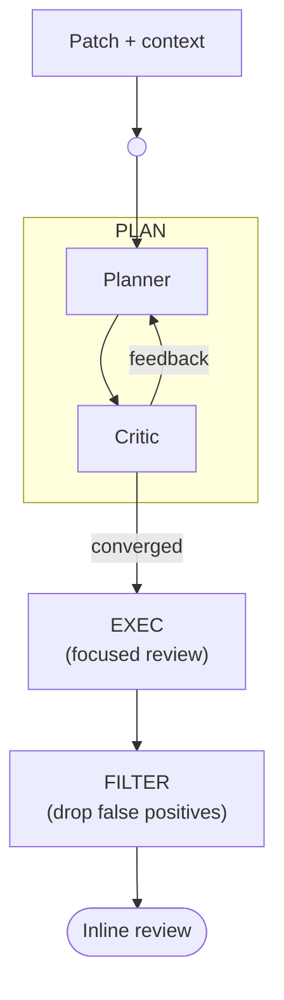
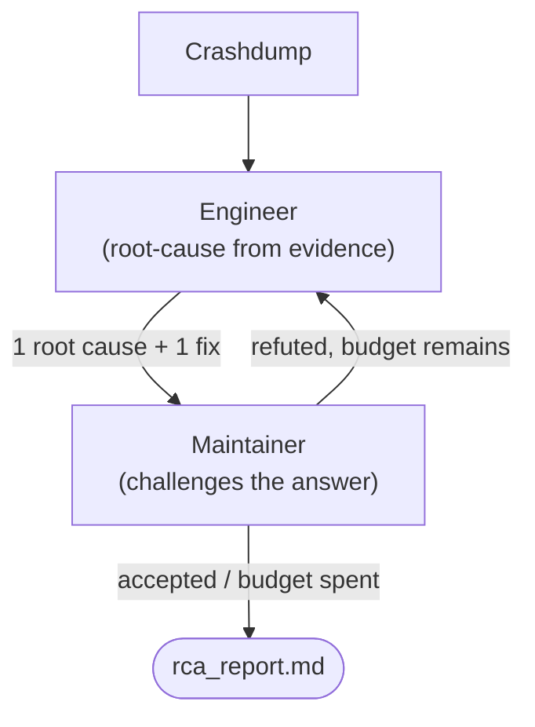

# PatchWise

[](LICENSE.txt)
[](https://www.python.org/downloads/)

> **PatchWise** automates patch review and static analysis for the Linux kernel, streamlining upstream contributions and ensuring code quality.

---

## Table of Contents

- [Features](#features)
- [Getting Started](#getting-started)
  - [Prerequisites](#prerequisites)
  - [Installation](#installation)
- [Usage](#usage)
  - [AI Code Review](#ai-code-review)
  - [Crashdump Root-Cause Analysis](#crashdump-root-cause-analysis)
  - [Mail Mode](#mail-mode)
- [Command-Line Options](#command-line-options)
- [Development](#development)
- [Getting in Contact](#getting-in-contact)
- [License](#license)

---

## Features

- **Automated Patch Review**: Runs static analysis and style checks on kernel patches.
- **Integration with Mailing Lists**: Processes patches sent via email and responds automatically.
- **Flexible Review Selection**: Choose which review checks to run.
- **Rich Logging**: Colorized and file-based logging for easy debugging.
- **LLM Integration**: Uses Artificial Intelligence for commit message analysis and suggestions.
- **AI Code Review**: Leverages artificial intelligence to provide insights on code quality and potential issues. Uses tree-sitter + ripgrep for context-aware code navigation. Support for multiple LLMs and providers, including OpenAI.
- **Downstream repo(1) Workspace Support**: Reviews patches in `repo(1)`-managed downstream workspaces (e.g. the Android Common Kernel), not just standalone upstream `.git` kernel trees. See [the note on downstream workspaces](#patch-review-options).
- **Crashdump Root-Cause Analysis** (`--rca`): Root-causes a kernel crashdump folder and proposes a fix.

---

## Getting Started

### Prerequisites

- Python 3.10 or newer
- Access to a Linux kernel git repository
- Docker installed, with permissions to run Docker commands (PatchWise runs reviews inside Docker containers)

### Installation

1. **Create and activate a virtual environment:**

   ```bash
   python3.10 -m venv .venv
   source .venv/bin/activate
   ```

1. **Install PatchWise:**

   ```bash
   pip install patchwise
   ```

1. **Set up your API key:**

   Obtain your API key from your provider and set it as an environment variable:

   ```bash
   export OPENAI_API_KEY=<your-api-key>
   ```

   Add this line to your shell profile (e.g., `~/.bashrc` or `~/.zshrc`) for persistence.

1. **Run help message:**

   ```bash
   patchwise --help
   ```

## Usage

1. **Run PatchWise:**

   Run PatchWise in the root of your kernel workspace:

   ```bash
   patchwise
   ```

   By default, PatchWise will review the `HEAD` commit. Use the `--commits` flag to review a specific commit:

   ```bash
   patchwise --commits <commit-sha>
   ```

   To run only short reviews, use:

   ```bash
   patchwise --short-reviews
   ```

   To run specific reviews, use the `--reviews` flag:

   ```bash
   patchwise --reviews AiCodeReview Checkpatch DtCheck
   ```

   To see available reviews and other options, run:

   ```bash
   patchwise --help
   ```

### AI Code Review

`AiCodeReview` reviews a patch in three phases: **PLAN** (a planner ↔ critic
loop splits the diff into analysis angles), **EXEC** (a focused reviewer works
those angles as a checklist against the real code), and **FILTER** (drops
proven false positives) before rendering the final inline review.

```bash
patchwise --reviews AiCodeReview
```



Each phase has its own iteration budget, each overridable via env:

| Phase | Default cap | Override env |
|-------|-------------|---------------|
| Critic loop | `MAX_PLAN_ITERATIONS = 10` rounds | `PATCHWISE_MAX_PLAN_ITERATIONS` |
| Critic (per round) | `CRITIC_ITER_CAP = 10` | `PATCHWISE_CRITIC_ITER_CAP` |
| Execution | `EXEC_ITER_CAP = 100` | `PATCHWISE_EXEC_ITER_CAP` |
| FP filter | `FP_ITER_CAP = 50` | `PATCHWISE_FP_ITER_CAP` |

Artifacts land in `SANDBOX_PATH`:
`prompt.md`, `plan.json`, `findings.md`, `fp_verdicts.json`,
`observability.json`.

### Crashdump Root-Cause Analysis

Root-cause a kernel crashdump instead of reviewing a patch. Point `--dump` at a
folder containing the dmesg/console log (and any parser output), and `--repo-path`
at the kernel source tree the crash came from:

```bash
patchwise --rca --dump <crashdump-folder> --repo-path <kernel-source>
```

`--repo-path` can be a standalone upstream `.git` kernel tree or a repo(1)-managed
downstream workspace (e.g. the Android Common Kernel) — the same workspace types
`AiCodeReview` supports.

An *engineer* agent investigates from the evidence and proposes one root cause and
one fix (as a diff); a *maintainer* agent then challenges that answer — surfacing
unstated assumptions, symptom-only fixes, and incorrect causes — until it holds.
Give the engineer a head start with any debugging you've already done:

```bash
patchwise --rca --dump <crashdump-folder> --repo-path <kernel-source> \
  --additional-context "perf_fuzzer + cpu-hotplug + stress-ng reproduces this"
```

Unlike the review pipeline there is **no planner or critic framing the search**:
the engineer investigates example-free (any up-front failure taxonomy or
subsystem menu would bound it to the listed classes — overfit), and the knowledge
base lives on the *maintainer*, which challenges a finished answer instead of
directing the investigation. While the maintainer refutes, the engineer's **same
conversation is resumed** (full history retained) with the questions appended, so
it re-investigates rather than starting over. The engineer's final accepted
answer is the report.



Each role draws from its own iteration/token budget (cumulative across resumes), overridable via env:

| Role | Default cap | Override env |
|------|-------------|---------------|
| Engineer | `EXEC_ITER_CAP = 500` iters, `ENGINEER_TOKEN_BUDGET = 20M` tokens | `PATCHWISE_EXEC_ITER_CAP`, `PATCHWISE_ENGINEER_TOKEN_BUDGET` |
| Maintainer | `MAINTAINER_ITER_CAP = 250` iters, `MAINTAINER_TOKEN_BUDGET = 10M` tokens | `PATCHWISE_MAINTAINER_ITER_CAP`, `PATCHWISE_MAINTAINER_TOKEN_BUDGET` |

An ambiguous or unparseable maintainer verdict accepts the engineer's answer
by default. Artifacts land in `SANDBOX_PATH`: `prompt.md`,
`maintainer_verdicts.json`, `rca_report.md`, `observability.json`.

> **Note:** The default sandbox location is `/tmp/patchwise/sandbox`. Override it
> with `PATCHWISE_SANDBOX_PATH=<path/to/sandbox>`.

### Example Workflow

```bash
cd linux-next   # your kernel workspace, with the patch to review already applied
patchwise
```

### Mail Mode

Instead of reviewing local commits, PatchWise can watch a mailbox, review
patches submitted to a mailing list, and reply with the review results. Enable
this with `--mail`:

> **Note:** Mail mode reviews patches against its own kernel tree (linux-next) in the sandbox
> (default sandbox path is `/tmp/patchwise/sandbox`, override with `PATCHWISE_SANDBOX_PATH`). It
> does not use `--repo-path`.

```bash
# Process unflagged mail once, printing the replies to stdout (does not send)
patchwise --mail

# Actually send the review replies (and flag processed mail)
patchwise --mail --send

# Keep watching the mailbox in a loop
patchwise --mail --watch

# Review a single message by its Message-ID
patchwise --mail --message-id 20250408-example-v6-1-526c61a207f6@example.com
```

Mail mode is configured through the `mail:` block of your user config file
(`~/.config/patchwise_config.yaml`), which is merged over the shipped defaults.
At minimum, set the mailbox credentials and the senders/lists you accept:

```yaml
mail:
    email: "you@example.com"
    password: "<app-password>"
    from_email: "PatchWise <you@example.com>"
    accepted_sender_domains: ["example.com"]
    accepted_lists: ["kernel@lists.example.com"]
    always_cc: ["maintainers@example.com"]
    additional_cc: ["kernel@lists.example.com"]
    send_mode: 2
    imap:
        server: "imap.gmail.com"
        port: 993
        ssl: true
    smtp:
        server: "smtp.gmail.com"
        port: 465
        ssl: true
```

`send_mode` controls who replies are addressed to:

- `0`: reply only to `always_cc` entries (falls back to the sender if `always_cc` is empty)
- `1`: reply to the sender, CC `always_cc`
- `2`: reply to the sender, CC the original To/Cc recipients (filtered to `accepted_sender_domains`) plus `always_cc` plus `additional_cc`

---

## Command-Line Options

- `-h`, `--help`: Show help message and exit
- `--mail`: Run the mail-handler loop instead of reviewing local commits. See [Mail Mode](#mail-mode).
- `--rca`: Root-cause a kernel crashdump folder instead of reviewing commits. See [Crashdump Root-Cause Analysis](#crashdump-root-cause-analysis).
- `--plain`: Disable the live dashboard and use plain log output.
- `--output-dir`: Directory to save the review/RCA results. (default: `/tmp/patchwise/output`, overridable via `PATCHWISE_OUTPUT_PATH`)

### Patch Review Options

- `--commits`: Space separated list of commit SHAs/refs, or a single commit range in start..end format. (default: [`HEAD`])
- `--repo-path`: Path to the workspace root. Must directly contain either `.repo` (a repo(1)-managed downstream workspace, e.g. the Android Common Kernel) or `.git` (a standalone upstream kernel); PatchWise raises otherwise. Uses your current directory if not specified. (default: `$PWD`)
- `--commit-dir`: Git subtree (has `.git`) holding the commit under review, when `--repo-path` is a broader workspace, e.g. `--repo-path .../kp6.0 --commit-dir kernel_platform/soc-repo`. Relative to `--repo-path` or absolute, and inside it. The agent navigates the whole `--repo-path` while the diff and (for upstream) tree reset use this subtree. Defaults to `--repo-path`.
- `--reviews`: Space-separated list of reviews to run. (default: all available reviews)
- `--short-reviews`: Run only short reviews. Overrides `--reviews`.
- `--install`: Install missing dependencies for the specified reviews. This will not run any reviews, only install dependencies.
- `--fix`: Output a version of the commit that fixes the reported issues, for reviews that support it (currently `AiCodeReview` and `Checkpatch`).

> **Downstream (repo(1)-managed) kernels support `AiCodeReview` only.** This
> covers workspaces like the Android Common Kernel (ACK). When `--repo-path`
> is a `.repo` workspace root, PatchWise treats the tree as read-only — the
> caller is responsible for syncing and checking out the change under review,
> and PatchWise does not reset, clean, or take ownership of it. Running any
> other review (static analysis, etc.) against such a tree is undefined.
> Standalone `.git` kernels (upstream) support the full set of reviews.
>
> Because a downstream tree is indexed in place, a large build-artifact tree
> (e.g. `out/`) can be orders of magnitude bigger than the kernel and make the
> tree-sitter index slow to build. PatchWise already skips the paths listed
> under `indexing.blocklist` in the config (default:
> `kernel_platform/{out,prebuilts,external}`); add your own build/output
> directories to that list in `~/.config/patchwise_config.yaml` if indexing is
> slow for your layout.

### Mail Options (require `--mail`)

- `--all`: Search all mail, not just unflagged mail. (default: unflagged only)
- `--since`: Only process messages on or after this date (ISO 8601, e.g. `YYYY-MM-DD`).
- `--before`: Only process messages before this date (ISO 8601, e.g. `YYYY-MM-DD`).
- `--message-id`: Process only messages with the given Message-ID(s).
- `-w`, `--watch`: Watch for new mail and process it in a loop.
- `--send` / `--no-send`: Send the review replies, or print them to stdout instead. (default: `--no-send`)

### Ai Review Options

- `--model`: Specify the AI model to use for code review. (default: `openai/Pro`).
- `--provider`: The base URL for the AI model API. (default: `https://api.openai.com/v1`)
- `--additional-context`: Extra text injected into the review/analysis prompt (e.g. a known reproducer or debugging notes). Shared across review and `--rca` modes.

### Crashdump RCA Options (require `--rca`)

- `--rca`: Root-cause a kernel crashdump folder instead of reviewing commits.
- `--dump`: Path to the crashdump folder (must contain a dmesg/console log).

The kernel tree is given with `--repo-path`; `--model`, `--provider`, `--additional-context`, and `--output-dir` are shared with the other modes.

### Logging Options

- `--log-level`: Set the logging level. (default: `INFO`)
- `--log-file`: Path to the log file. (default: `<SANDBOX_PATH>/patchwise.log`, i.e. `/tmp/patchwise/sandbox/patchwise.log` unless `PATCHWISE_SANDBOX_PATH` is set)

## Development

If you'd like to develop new features or fix existing issues:

- Fork the repository and create a new branch for your changes.
- Make your changes with clear, descriptive commit messages.
- Ensure your code follows the project's coding standards and passes all tests.
- Submit a pull request (PR) with a detailed description of your changes to pull your changes into the staging branch in the main repository.

Please make sure to follow our contribution guidelines before submitting a pull request. [CONTRIBUTING.md](CONTRIBUTING.md)

## Getting in Contact

- [Report an Issue on GitHub](../../issues/new/choose)
- [Open a Discussion on GitHub](../../discussions/new/choose)
- [E-mail us](mailto:Maintainers.PatchWise@qualcomm.com,achillar@qti.qualcomm.com) for general questions

## License

PatchWise is licensed under the BSD-3-clause License. See [LICENSE.txt](LICENSE.txt) for the full license text.
